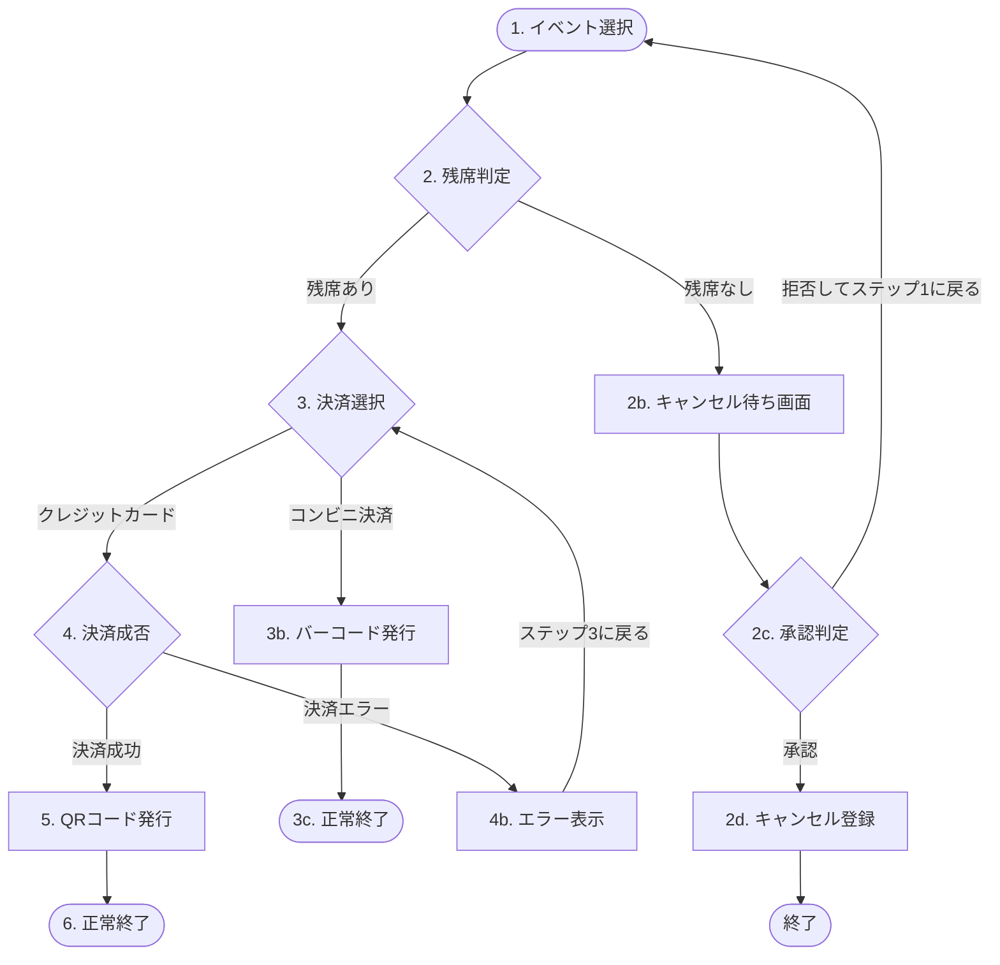

# Daily Advanced Lesson Log (2026-06-08)

- **Target Area (AL TA Chapter)**: JSTQB Advanced Level Test Analyst (AL TA) 第3章「テスト技法」精密シナリオ演習 (Drilling)
- **K4-Level Analysis Result**:
    - **決定表の最小化（ドンケア `-` マージルール）**: 
        - 「アクションが同じで、かつ1つの条件だけがYとNで異なり、他のすべての条件が一致している」というゴールデンルールを再徹底した。
        - 2つ以上の条件が異なっている場合は、アクションが同じであっても安易にマージしてはならない（他の正当なルールを破壊し、致命的なバグがすり抜ける原因になるため）。
    - **ペアワイズ法の論理的下限（L値）**:
        - 任意の2因子間の全ペアを配置するための論理的下限値は、最も水準数が多い「上位2因子の水準数の積」であることを理解した。今回（4×3=12件）において、網羅率を満たさない9件を却下するプロセスを確立した。
    - **ユースケースのフロー網羅**:
        - ユースケースのフローを「フローチャート（制御フロー図）」として視覚化し、スタートからゴールまで一本の糸で繋ぐイメージでパスをなぞる設計方法を確認。
        - ループ（元のステップに戻るフロー）を利用して、1つのテストケースで複数のフロー（例: A2で戻ったあとにA1を実行、E1で戻ったあとにB1を実行）を合流・網羅させることで、最小テストケース数を3件に抑えられることを学習。

- **Test Design Optimization Rate**:
    - 決定表: 誤ったマージによる削減（3ケース）を回避し、正しい論理的最小化（5ケース）で設計。
    - ペアワイズ: 理論的下限12ケースを算出し、不十分な削減（9ケース）によるテスト漏れを防止。
    - ユースケース: 全5フローの網羅を3ケースに最適化。

- **AI/Process Improvement Idea**:
    - **ユースケースフローのAI設計ガードレール**:
      ユースケース仕様書からAIに最小テストケースを生成させる場合、事前にMermaid記法等のフロー構造を抽出させ、かつ「元の画面に戻るループを考慮して、1つのテストケースで複数の分岐ルートを合流させて最小化すること」をプロンプトで指示する。

### ユースケース構造のMermaidフローチャート

- **Next Action**:
    - 第3章の弱点克服（習得済み🟩への移行）を完了。
    - 次回は、もう一つの弱点である「第2章：リスクベーステストにおける優先順位付けと実行順序の推論エラー」の精密演習に進む。
